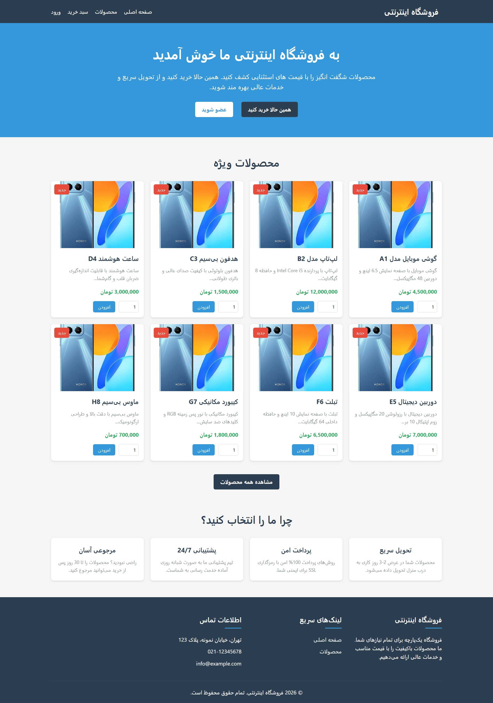
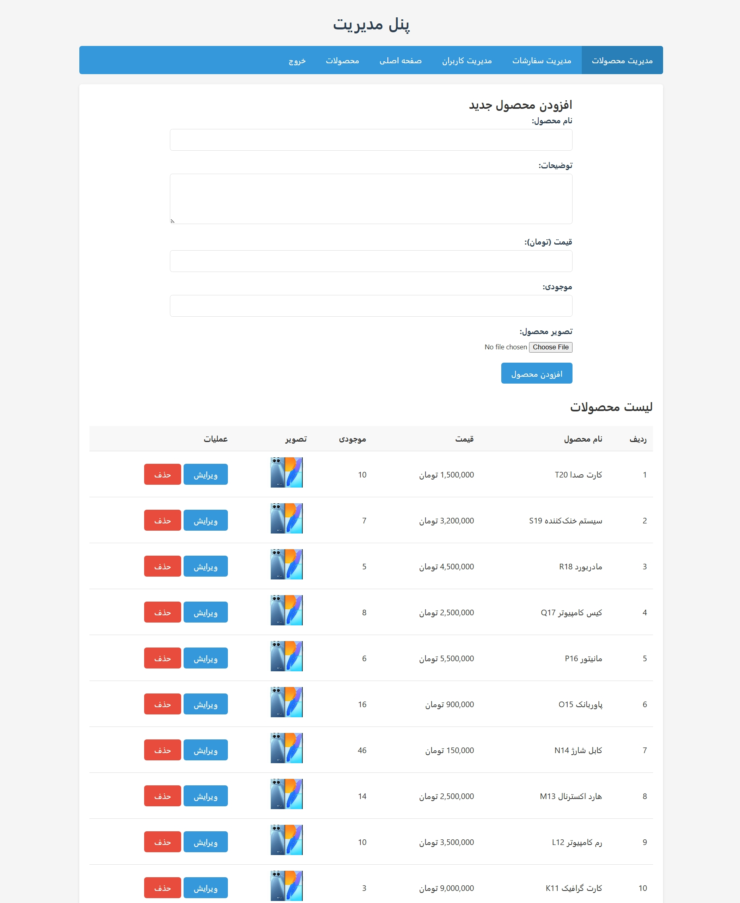

# 🛒 پروژه آنلاین شاپ (فروشگاهی) 

یه پروژه ساده، تمیز و آماده برای تحویل دانشگاه. با PHP خام و MySQL نوشته شده.

---

## 🖼️ چندتا عکس از پروژه

---

## ✨ امکانات پروژه

### 🛍️ بخش کاربر
- ثبت‌نام و ورود کاربر
- نمایش محصولات با دسته‌بندی
- صفحه جزئیات محصول
- سبد خرید
- ثبت سفارش

### 🔐 پنل مدیریت
- داشبورد مدیریتی
- افزودن، ویرایش و حذف محصولات
- مدیریت سفارش‌ها
- مدیریت کاربران

---

## 🛠️ تکنولوژی‌ها

- HTML5 / CSS3
- JavaScript
- Bootstrap 5
- PHP (بدون فریمورک)
- MySQL

---

## 📞 راه‌های ارتباط با من

- 📧 **ایمیل:** mh.mirzaii1382@gmail.com
- 📱 **تلگرام:** [@hoseiin_28](https://t.me/hoseiin_28)
- 📷 **اینستاگرام:** [@Hoseiin_28](https://instagram.com/Hoseiin_28)
- 💼 **لینکدین:** [Hoseiin Mirzaii](https://linkedin.com/in/Hoseiin_28)

---

## 👨‍💻 درباره من

محمدحسین میرزایی هستم، دانشجوی کارشناسی کامپیوتر و برنامه‌نویس فول‌استک PHP. پروژه‌های دانشجویی و سفارشی انجام می‌دم.

---

⭐ **اگه پروژه رو پسندیدی، یه ستاره بده!**
